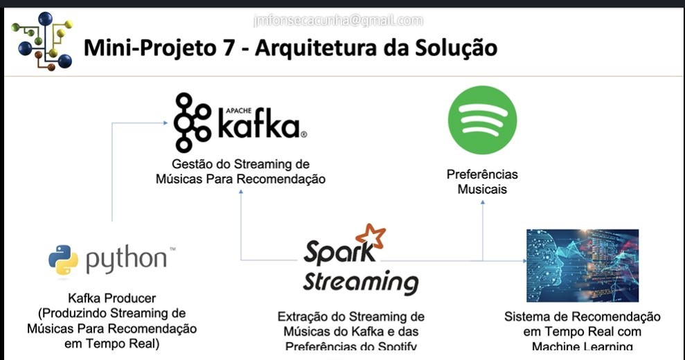
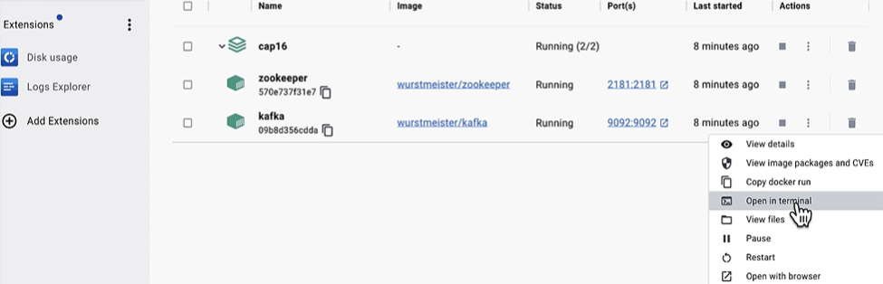
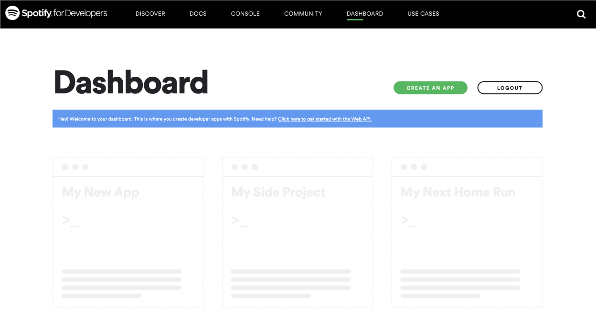
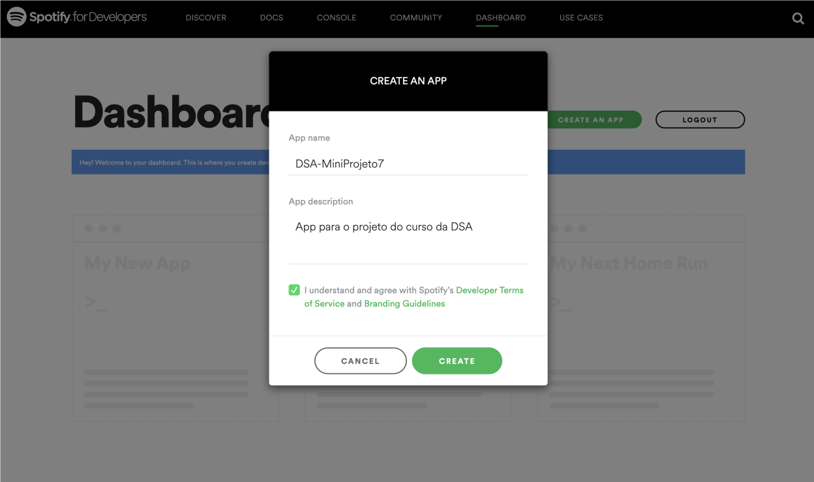
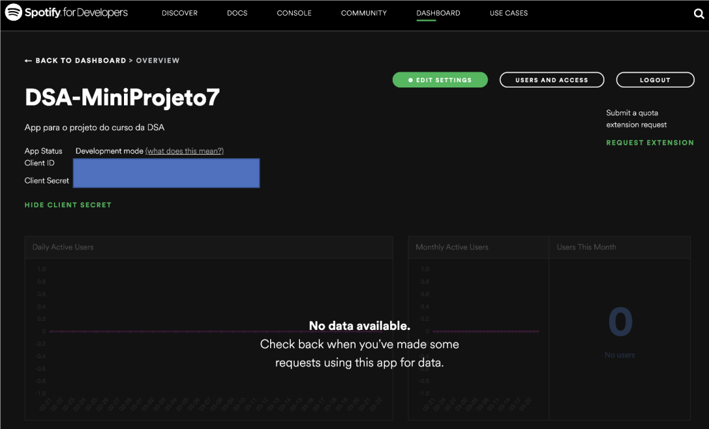
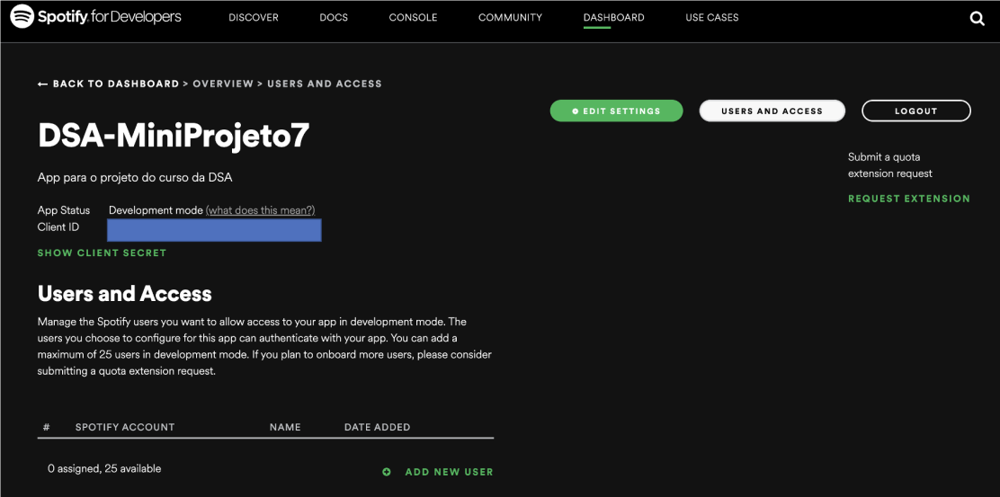
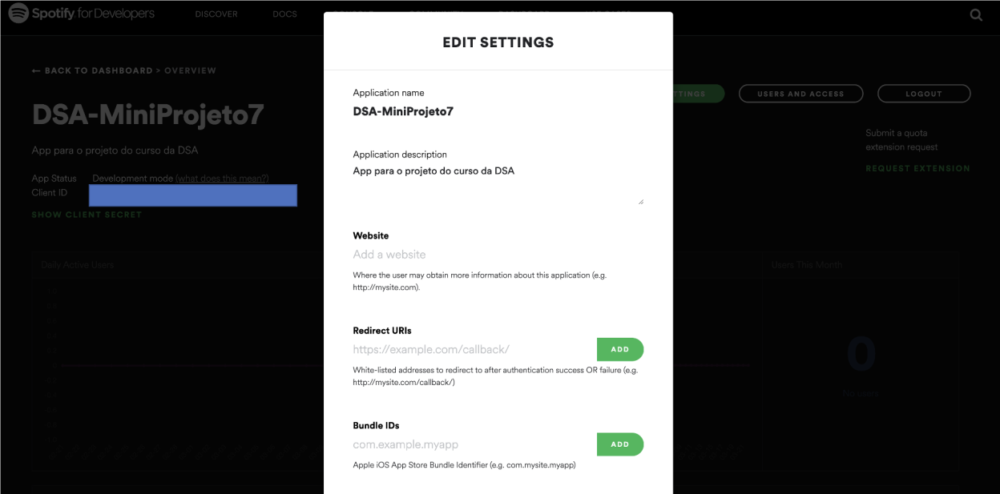
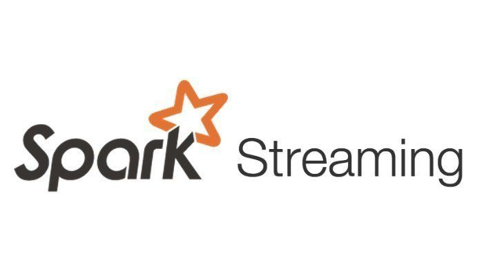

 

# Sistema de Recomendação Spotify em Tempo Real  com Machine Learning, PySpark, Spark Streaming e Kafka

  

# Objetivo
O objetivo deste projeto é implementar Sistema de Recomendação em tempo real.

Um sistema de recomendação é uma ferramenta ou algoritmo utilizado para sugerir itens, conteúdo ou ações relevantes para os usuários, com base em seus interesses, comportamentos,
preferências e histórico de interações.

Esses sistemas são amplamente utilizados em plataformas online como e-commerce, serviços de streaming, redes sociais e sites de notícias, para oferecer uma experiência personalizada aos usuários e aumentar a satisfação e o engajamento. Em nosso caso, vamos recomendar músicas de acordo com as preferências dos usuários. Este projeto é composto de diversas partes uma vez que toda a infraestrutura necessária será construída passo a passo. 

# Definição do problema e fonte de dados

Cada usuário tem suas preferências musicais e neste projeto vamos recomendar novas músicas de acordo com as preferências do usuário. De fato, é exatamente isso que a Spotify faz com os usuários da sua app, para que os usuários assinem o serviço pago da empresa ou mantenham o plano existente.

Usaremos 2 streams de dados:

**Stream 1** – Usaremos um dataset com milhares de músicas. A partir desse dataset que recomendaremos as músicas para o usuário. Os dados foram extraídos do link abaixo:
https://research.atspotify.com/datasets

**Stream 2** – Vamos extrair as preferências musicais do usuário direto do Spotify com a API gratuita fornecida pela empresa. Para isso teremos que criar uma conta gratuita no Spotify, pesquisar músicas ou artistas preferidos, dar um like em algumas músicas para gerar uma massa de dados. Depois disso vamos extrair as preferências musicais e construir o sistema de recomendação.

# Arquitetura da solução

  

# Criando os Containers Docker
Para este projeto, não vamos utilizar instalação local. Em vez disso, vamos usar um container Docker. A estrutura está no arquivo “docker-compose.yml” e consiste em criar dois containers Docker: Um para o Zookeeper e outro para o Kafka. O Zookeeper é responsável por gerenciar o cluster Kafka, enquanto o Kafka oferece um arquivo de log para gravar o streaming.  Para isso escolhemos as imagens do Docker Hub, já configurados no arquivo “docker-compose.yml”

  

## Criando o Container

Abra o prompt de comando ou terminal, navegue até a pasta onde estão os arquivos do projeto e execute o comando abaixo:

> docker-compose up -d

_É recomendável deletar todas imagens anteriores que estiverem no Docker Desktop._

## Criando o tópico no Kafka

Agora vamos criar um tópico no apache Kafka. O tópico nada mais é do que um arquivo de log, o arquivo de log é gerenciado pelo serviço do Kafka e permite que sejam mandados mensagens para este tópico, que é o producer, que vamos fazer em python.

Logo após podemos utilizar o consumer, que faremos em Spark Streaming, para consumir as mensagens do tópico. 

Para isso, vamos acessar o Docker Desktop, clicar no três pontinhos no container Kafka e em seguida, clicar em Open in terminal, vide figura abaixo:

  

Agora vamos executar os seguintes comandos no terminal do Docker Desktop:

>  bash
> cd /opt/kafka/bin
> cd /opt/kafka/bin#

1-	Cria um tópico
> kafka-topics.sh --create --zookeeper zookeeper:2181 --replication-factor 1 --partitions 1 --topic dsaminiprojeto7

2-	Lista os tópicos criados
> kafka-topics.sh --list --zookeeper zookeeper:2181

3-	Detalhes sobre o tópico
> kafka-topics.sh --describe --zookeeper zookeeper:2181

4-	Consome o Streaming
> kafka-console-consumer.sh --bootstrap-server localhost:9092 --topic dsaminiprojeto7 --from-beginning

# Criando o Producer

Todo o passo para criação do nosso kafka producer em linguagem Python, está documentado no script “Git_Hub_Parte_1_Sistema_Recomendacao_Spark_Kafka_Criando_Producer”. É o Kafka Producer que vai produzir o streaming de dados.

Para checar o streaming sendo consumido, acessamos o Docker desktop, no container do Kafka e executamos o código abaixo:
> kafka-console-consumer.sh --bootstrap-server localhost:9092 --topic dsaminiprojeto7 --from-beginning 

# Configurando o acesso via API na conta do Spotify

Siga os passos abaixo, para configurar o acesso via API na sua conta do Spotify:

1-	Se ainda não tiver conta, então crie uma no Spotify acessando o link abaixo:

https://spotify.com

2-	Acesse o site de developer do Spotify:

https://developer.spotify.com/

3-	Clique em Dashboard no menu superior ou então acesse direto pelo link abaixo e faça login com sua conta do Spotify:

https://developer.spotify.com/dashboard/

4-	Depois de fazer o login aceite os termos de uso. Você então terá acesso ao Dashboard onde poderá criar a app, conforme a tela abaixo.

  

5-	Clique no botão verde “Create An App”.

6-	Dê um nome e descrição para sua app e clique no botão “Create”.

  

7-	Sua app foi criada conforme a tela abaixo. Agora vamos configurá-la.

  

8-	Copie o Client ID e o Client Secret. Você vai precisar disso para autenticação via Spark Streaming. Não compartilhe essas chaves e mantenha em segurança.

9-	Clique no botão “Users and Access” na parte superior do Dashboard. Clique então em Add New User e adicione sua conta do Spotify digitando seu nome e e-mail, que você usou na criação da conta no Spotify.

  

10-	Clique agora no botão “Edit Settings” na parte superior.

  

11-	Preencha os campos Website e Redirect URLs com os valores abaixo e clique no botão Add. Clique em Save no final da tela.

Website: https://meusite.com

Redirect URLs: http://localhost:7777/callback

Você usará o endereço da Redirect URL na autenticação do Spark Streaming.

12-	Sua app está criada e configurada! Você agora pode extrair os dados do Spotify!

# Consumindo com o Spark Streaming - Consumer

  

Todo o passo a passo de consumo do streaming, processamento e normalização dos dados, extração de streaming do spotify e construção do modelo de aprendizagem de máquina para entrega do sistema de recomendação, está documentado no  notebook “Git_Hub_Parte_2_Sistema_Recomendacao_Spark_Kafka_Consumer_Machine_Learning”. O processo do consumer é feito utilizando o Spark Streaming.

# Conectando o Spark Straming no Apache Kafka

Para conectar o Spark Streaming no Apache Kafka precisamos de conectores, que estão disponíveis através de arquivos .jar. Abaixo a lista de conectores que estamos usando no projeto e que estão salvos na pasta jars deste repositório:

https://mvnrepository.com/artifact/org.apache.spark/spark-sql-kafka-0-10_2.12/3.2.1

https://mvnrepository.com/artifact/org.apache.kafka/kafka-clients/2.1.1

https://mvnrepository.com/artifact/org.apache.spark/spark-token-provider-kafka-0-10_2.13/3.3.2

https://mvnrepository.com/artifact/org.apache.commons/commons-pool2/2.8.0

https://mvnrepository.com/artifact/org.apache.spark/spark-token-provider-kafka-0-10_2.12/3.1.2

